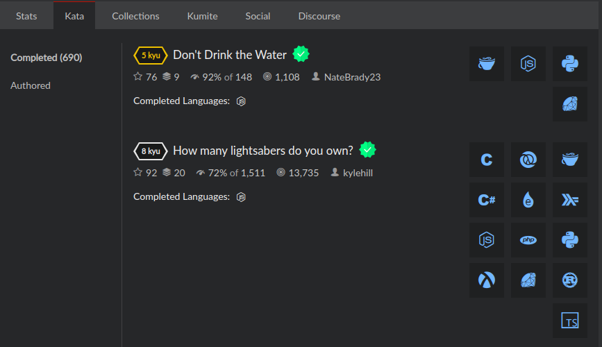
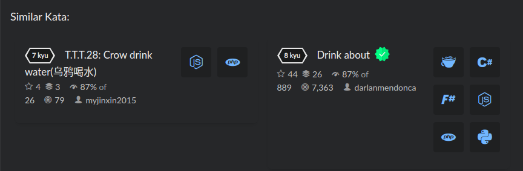

# Codewars Completed Kata indicator

I enjoy doing the challenges on [codewars](https://www.codewars.com) and there are thousands of Katas to complete. Finding the next easiest Kata to do is usually a task on its own. A hack I use is to visit the profile of people who are at my current skill level (KYUs) and try to complete the same katas.
Unfortunately you have to open each kata to confirm you haven't already solved it.
Through this browser extension is an attempt to fix that.

## How to Install

### A. Setup up the server

1. Create a db.json file to act as the store for your completed katas.
2. Run server `node server`

### B. Load the extension

1. Open the extension page `chrome://extensions`
2. Enable developer mode
3. Click load unpacked
4. Navigate to the the project directory and you are done.

## How it works

The extension will add a check mark to any katas that I have completed. When I complete any new
kata, I have to go back to my profile and it will then look for newly updated katas to keep the backend updated.
It only works when the page is loaded initially from the url, otherwise you have to reload to get the full effect.

## sidenote

I have hardcoded my username to the update script, as a result it will update the solved katas only when you visit the completed katas tab of my [profile](https://www.codewars.com/users/colleowino/completed).
